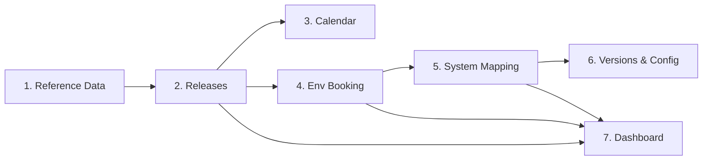
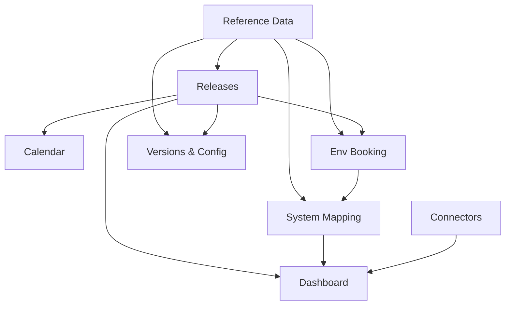

# Release Desk — Workflow Guide

> **Word version:** [WORKFLOW.docx](./WORKFLOW.docx) (same content, formatted for sharing)

This document explains how **Sentinel / Release Desk** fits together: what to do first, how pages connect, and the day-to-day steps for release managers.

---

## What Release Desk does

Release Desk helps you:

1. **Plan** what is releasing and when  
2. **Prepare** test environments for end-to-end validation  
3. **Track** upstream/downstream system dependencies  
4. **Monitor** portfolio health, P1 issues, and connector sync status  

All core data (departments, applications, environments, releases, bookings, mappings, versions) lives in the **SQLite database**. Pages read from the same source so changes in one place appear everywhere else.

---

## Roles

| Role | Access |
|------|--------|
| **Read only** | View dashboard, releases, calendar, bookings, mapping, versions |
| **Editor** | Everything read-only can do, plus create/edit releases, book environments, manage reference data, promote versions, sync connectors |
| **Admin** | Same as Editor (reference data and configuration) |

Sign in at `/login` and pick a role for the demo session.

---

## High-level workflow



**Rule of thumb:** Set up master data once → plan releases → book and map environments → promote versions → use the dashboard for daily checks.

---

## Step-by-step workflow

### Step 0 — Start the app

```bash
npm run db:setup   # first time, or after schema changes
npm run dev
```

Open [http://localhost:3000](http://localhost:3000) and sign in as **Editor** or **Admin** for full interactivity.

---

### Step 1 — Reference Data (foundation)

**Page:** Operations → **Reference Data** (`/admin/reference-data`)

Configure the master data every other page depends on:

| Section | Fields |
|---------|--------|
| **Departments** | name, head |
| **Applications** | name, department, type, product owner, tech lead, support, criticality |
| **Environments** | application, name, type (Dev/Test/UAT/Prod), owner, last DB refresh, status |

**Actions:**
- Add / edit / delete rows inline  
- **CSV upload** for bulk import  

**Why first?** Dropdowns on Releases, Env Booking, and System Mapping all pull from these tables.

---

### Step 2 — Releases (plan the work)

**Page:** Release Desk → **Releases** (`/releases`)

Each release includes:

- Release ID (`releaseCode`)  
- Name  
- Program / Project (use `N/A` for hotfixes or infra)  
- Owner, status, release date  
- Priority and impact (High / Medium / Low)  
- Department  
- Application(s)  
- Depends on (other releases)  

**Actions:**
- **New release** — create from the list page  
- **Click a row** — open the release detail page  
- **Edit / Delete** — from the list (Editor/Admin)  

**Detail page** (`/releases/[id]`):
- Change status with quick buttons  
- Record **Go / No-Go** (saved to audit trail)  
- Add notes  
- Jump to **Dependencies**, **Env Booking**, or **System Mapping**  

---

### Step 3 — Release Calendar (when things land)

**Page:** Release Desk → **Calendar** (`/calendar`)

- **Period filter:** Month | Quarter | Year  
- **View:** Calendar grid or Timeline  
- Releases come from the database (same as the Releases list)  
- Click a release to open its detail page  

Use this to see deployment windows and portfolio load for the selected period.

---

### Step 4 — Environment Booking (can we test?)

**Page:** Release Desk → **Env Booking** (`/booking`)

Used when end-to-end testing needs **one or more applications** at the same time.

**Workflow:**

1. Select applications from the **multi-select dropdown** (from reference data)  
2. Set **From** and **To** dates (calendar pickers)  
3. Enter a **purpose** (e.g. “FIN SIT 1”)  
4. Click **Check Availability**  
   - If available → **Book Now** appears  
   - If not → see who booked it (person, team, dates, purpose)  
5. Review **Current bookings** at the bottom of the page  

Bookings are stored in the database and feed into **System Mapping** risk analysis.

---

### Step 5 — System Mapping (how systems connect)

**Page:** Release Desk → **System Mapping** (`/system-mapping`)

Documents which application environment talks to which (upstream/downstream).

**Workflow:**

1. **Mapping notes** — describe the setup in plain language  
2. **Generate mapping from notes** — AI suggests edges (with fallback heuristics)  
   - Or **Add mapping edge** manually using app/env dropdowns  
3. Set **analysis period** (From / To dates)  
4. Review **Mapping risks** — flags when a required mapped environment is already booked in that period  
5. Manage edges (delete custom edges as needed)  

Example risk: *“SAP TEST is required by FIN UAT mapping but is booked by another team during your test window.”*

---

### Step 6 — Versions & Config (promotion and topology)

**Page:** Release Desk → **Versions & Config** (`/environments`)

Live view from the database:

- **Release timeline** — click entries to filter by department/app  
- **Environment booking** cards — per application  
- **System topology** — applications and environments  
- **Current Version matrix** — DEV / TEST / PROD per application  

**Promotion workflow:**

1. Open the version matrix  
2. Find an application with **drift** (DEV/TEST ahead of PROD)  
3. Click **Promote →** to copy the version to the next stage (DEV→TEST or TEST→PROD)  
4. Requires **Editor** or **Admin**  

Cross-panel selection: timeline → topology → matrix highlights the same application.

---

### Step 7 — Dashboard (daily monitoring)

**Page:** **Dashboard** (`/dashboard`)

Morning check-in:

1. **Period toggle** — Month | Quarter | Year (default: Month)  
2. **AI Daily Summary** — portfolio briefing  
3. **Summary counts** — Planned, In progress, Blocked, At risk  
4. **Connector last-sync** — Jira, GitHub, ServiceNow, Confluence  
5. **P1 issues only** — items that may need hotfix attention  

No release-level drill-down here by design — use Releases or Calendar for detail.

---

### Step 8 — Connectors (integration health)

**Page:** Operations → **Connectors** (`/connectors`)

- **Release Desk integrations** panel — live sync times for the four MVP sources  
- **Sync now** — refresh last-synced timestamp (Editor/Admin)  
- Full connector catalog below is demo/static data for stakeholder presentations  

---

## End-to-end scenario

**Goal:** Ship FIN billing changes that depend on SAP and CRM for UAT.

| Step | Where | What you do |
|------|-------|-------------|
| 1 | Reference Data | Confirm FIN, SAP, CRM apps and UAT/Test environments exist |
| 2 | Releases | Create release `RD-2026-0xxx`, link FIN + SAP, set dependency on platform release |
| 3 | Calendar | Confirm date fits the quarter plan |
| 4 | Env Booking | Select FIN + SAP + CRM, pick UAT dates, Check → Book Now |
| 5 | System Mapping | Set analysis period, verify FIN UAT → SAP TEST mapping, fix risks if booked |
| 6 | Versions & Config | Promote SAP TEST build toward PROD when ready |
| 7 | Release detail | Go/No-Go decision, status → In Progress / Complete |
| 8 | Dashboard | Confirm no new P1s, review AI summary |

---

## How data flows between pages



---

## Page quick reference

| Route | Purpose | Interactive actions |
|-------|---------|---------------------|
| `/login` | Sign in | Pick role (demo SSO) |
| `/dashboard` | Portfolio summary | Period toggle, read AI summary & P1s |
| `/admin/reference-data` | Master data | CRUD, CSV import |
| `/releases` | Release list | Create, edit, delete, open detail |
| `/releases/[id]` | Release command | Status, Go/No-Go, notes, audit trail |
| `/releases/[id]/dependencies` | Dependency graph | Visual map of apps, deps, mapping |
| `/calendar` | Schedule view | Period + Calendar/Timeline, open release |
| `/booking` | Env reservation | Multi-app book, availability check |
| `/system-mapping` | Env relationships | Notes, generate, add edges, risk scan |
| `/environments` | Versions & topology | Promote versions, cross-filter panels |
| `/connectors` | Integrations | Sync now (MVP sources) |

---

## Demo vs production data

Release Desk uses **two intentional data layers**. Both are required:

| Layer | Purpose | Source |
|-------|---------|--------|
| **Release Desk MVP** | Operational workflow — reference data, releases, booking, mapping, versions | SQLite database (seed via `npm run db:setup`) |
| **Synthetic demo** | Rich stakeholder demos — command center, Quick Start scenarios, portfolio views | `lib/dummy-data.ts` + `localStorage` |

### Synthetic demo (keep this)

Used for screen recordings and guided walkthroughs:

| Area | File / feature |
|------|----------------|
| Quick Start / Templates | `lib/quick-start-templates.ts` → links like `/releases/rel-v2141` |
| Release command center | Go/No-Go, deployment monitor, CAB, tickets, commits |
| Executive, Insights, Compare | `lib/dummy-data.ts` |
| Agents, Knowledge Graph | `lib/dummy-data.ts` |
| Connectors catalog (59 items) | `lib/dummy-data.ts` |
| History Log (live decisions) | `localStorage` via release store |

Release detail pages auto-detect the layer: IDs like `rel-v2140` open the **synthetic command center**; database IDs open the **MVP release detail**.

| Area | Source |
|------|--------|
| Reference data, releases list/detail (DB IDs), booking, mapping, versions, dashboard counts, P1s, connector sync (top 4) | **Database (MVP)** |
| Demo release command center (`rel-*` IDs), Executive, Insights, Compare, Agents, Knowledge Graph, full connector catalog | **Synthetic demo** |
| Authentication | **Demo role picker** (real Microsoft SSO not wired) |

---

## Related docs

- [README.md](./README.md) — setup and run instructions  
- [docs/ENVIRONMENT-DESK.md](./docs/ENVIRONMENT-DESK.md) — environment desk component details  
- [CHANGELOG.md](./CHANGELOG.md) — release history  

---

## Suggested first-time path (15 minutes)

1. Sign in as **Editor**  
2. Skim **Reference Data** (pre-seeded)  
3. Open **Releases** → click **RD-2026-0140** → try status + Go  
4. **Env Booking** → select SAP + FIN → check dates → book  
5. **System Mapping** → set dates → review risks  
6. **Versions & Config** → promote SAP  
7. **Dashboard** → read AI summary and P1 list  

That completes one full pass through the Release Desk workflow.
